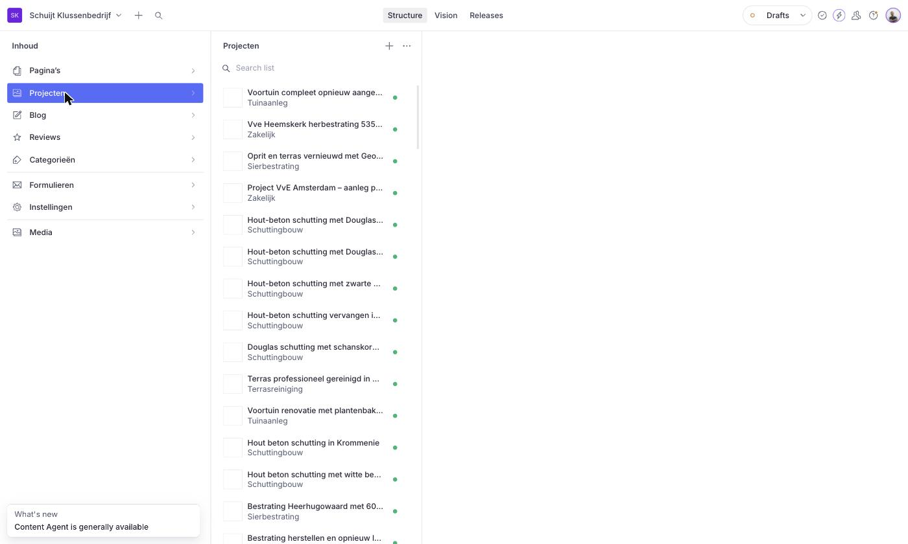
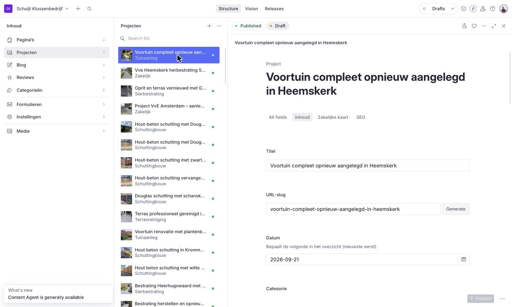
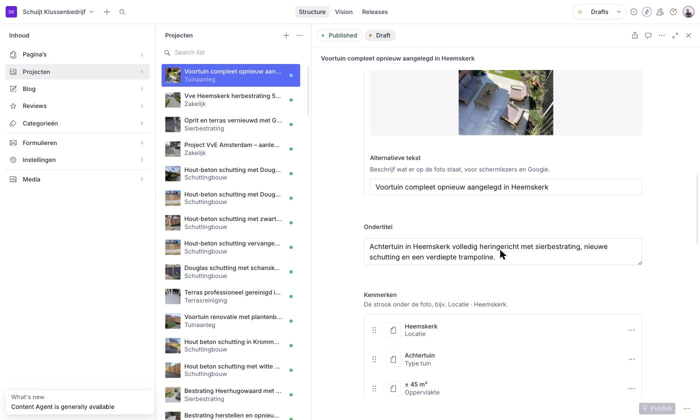
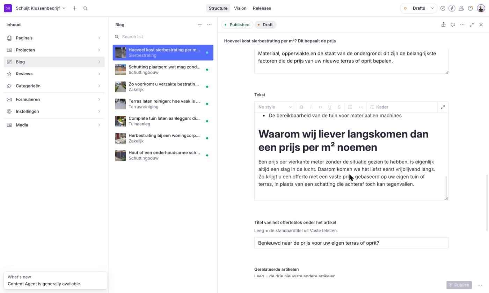
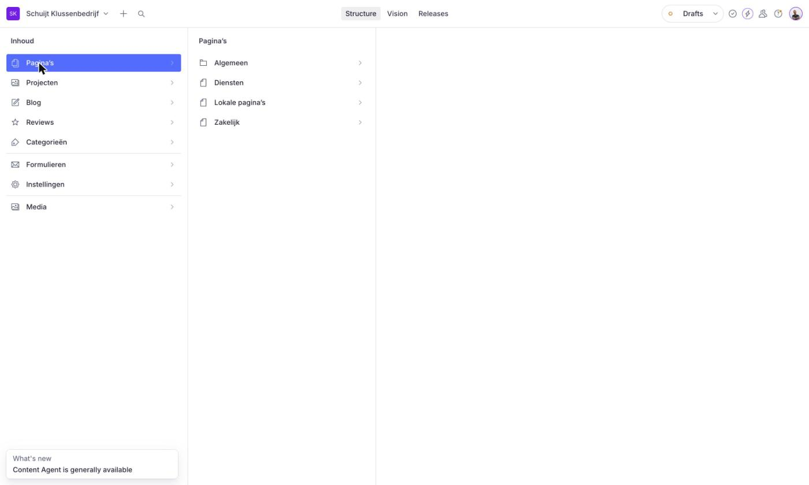
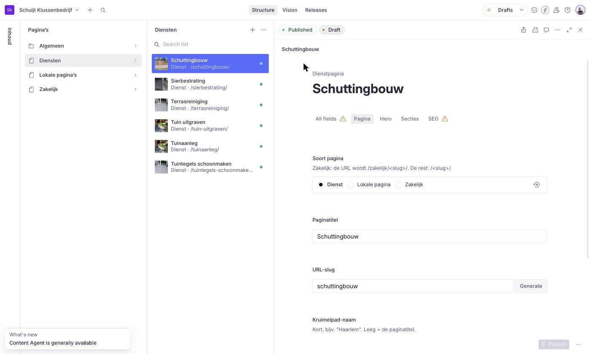
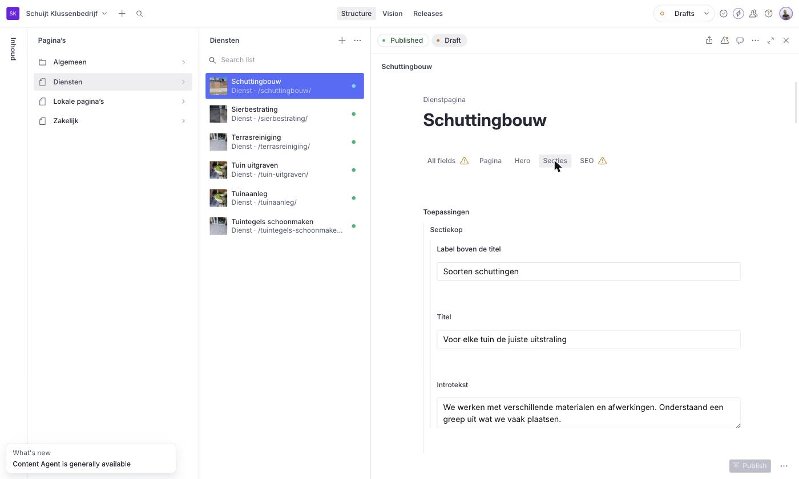

# Handleiding: de website beheren in Sanity

Met deze handleiding pas je zelf pagina's, projecten en blogartikelen aan. Je hoeft niets te kunnen programmeren. Alles doe je in het beheerscherm, "Sanity Studio" genoemd.

---

## 1. Inloggen en de indeling

Open de link naar de Studio die je van ons hebt gekregen en log in met je account.

Aan de **linkerkant** staat het menu:

| Menu-item | Waar is het voor |
|---|---|
| **Pagina's** | Home, Zakelijk, Diensten, lokale pagina's, tekstpagina's en de overzichtspagina's |
| **Projecten** | Al je uitgevoerde projecten |
| **Blog** | Blogartikelen |
| **Reviews** | Klantreviews |
| **Categorieën** | Groepen voor projecten en blogs (bijv. Sierbestrating) |
| **Instellingen** | Menu, footer en algemene gegevens (niet nodig voor dagelijks gebruik) |
| **Media** | Al je geüploade foto's |

Klik je op een onderdeel, dan verschijnt daarnaast een lijst. Klik je op een item in die lijst, dan opent rechts het formulier waarin je de inhoud invult.

---

## 2. De basis: wijzigen, opslaan en publiceren

Dit geldt voor álles in de Studio.

1. **Open** het item dat je wilt aanpassen.
2. **Pas de tekst of foto aan.** Wijzigingen worden automatisch bewaard als *concept*. Bezoekers zien ze nog **niet**.
3. Klik rechtsonder op de groene knop **Publish** (Publiceren).
4. Wacht ongeveer **een minuut**. Daarna staat de wijziging op de website.

> **Belangrijk:** zonder op *Publish* te klikken verandert er niets op de website. Zie je een oranje bolletje of het woord *Draft* bij een item? Dan is het nog niet gepubliceerd.

**Iets ongedaan maken?** Klik rechtsboven op de klok (*Review changes* / *History*). Daar zie je eerdere versies en kun je terug naar een oudere versie.

**Verplichte velden** zijn rood gemarkeerd. Zolang die leeg zijn, kun je niet publiceren.

**Gele driehoekjes** (bijvoorbeeld bij een tabblad) zijn alleen adviezen, zoals "deze SEO-titel is wat lang". Je kunt gewoon publiceren.

Linksboven in het formulier zie je **Published** en **Draft**: dat is de gepubliceerde versie en jouw concept. De knop **Publish** rechtsonder is grijs zolang je niets hebt gewijzigd.

**Handige velden die overal terugkomen**

- **Alternatieve tekst** (bij foto's): beschrijf kort wat er op de foto staat, bijvoorbeeld "Nieuwe oprit van grijze klinkers in Heemskerk". Dit helpt Google en mensen die de site laten voorlezen.
- **SEO** (onderaan veel items, ingeklapt): hier bepaal je hoe de pagina in Google verschijnt.
  - *Metatitel*: maximaal ca. 65 tekens. Leeg laten = de gewone titel.
  - *Metabeschrijving*: maximaal ca. 160 tekens. Dit is de korte tekst onder de titel in Google.
  - *Niet indexeren*: alleen aanvinken als de pagina **niet** in Google mag komen.

---

## 3. Foto's toevoegen

Bij elk fotoveld kun je:

- een foto **slepen** naar het vak, of
- op **Upload** klikken en een foto van je computer kiezen, of
- **Select** kiezen om een foto te hergebruiken die je al eerder hebt geüpload.

Na het uploaden kun je de foto **bijsnijden en het middelpunt bepalen** (het "hotspot"-icoon): sleep het rondje naar het belangrijkste deel van de foto. Zo blijft dat deel in beeld op telefoon en computer.

**Tips voor foto's**
- Gebruik liggende foto's (breder dan hoog) voor de hoofdfoto.
- Geen zorgen over bestandsgrootte: de website maakt ze automatisch kleiner.
- Vul altijd de *alternatieve tekst* in, tenzij het veld zegt dat leeg mag.

---

## 4. Projecten

Projecten staan onder **Projecten** in het menu, met de nieuwste bovenaan.

### Een nieuw project toevoegen

1. Klik op **Projecten** en dan op het **+**-icoon (rechtsboven in de lijst).
2. Vul de velden in het tabblad **Inhoud** in:

| Veld | Uitleg |
|---|---|
| **Titel** *(verplicht)* | Naam van het project, bijv. "Sierbestrating oprit Heemskerk" |
| **URL-slug** *(verplicht)* | Het adres van de pagina. Klik op **Generate**: het wordt automatisch gemaakt uit de titel. Het project komt dan op `jouwsite.nl/<slug>/` |
| **Datum** *(verplicht)* | Bepaalt de volgorde: nieuwste project staat bovenaan |
| **Categorie** *(verplicht)* | Kies uit de lijst, bijv. Sierbestrating of Schuttingbouw |
| **Hoofdfoto** *(verplicht)* | De grote foto bovenaan en in het overzicht |
| **Ondertitel** | Korte zin onder de titel |
| **Kenmerken** | De strook onder de foto (max. 4), bijv. *Locatie · Heemskerk*. Klik **Add item** en vul *Label* en *Waarde* in |
| **Over dit project** | De beschrijving van het project |
| **Uitgevoerde werkzaamheden** | Een lijstje: klik **Add item** per werkzaamheid |
| **Foto's** | De fotogalerij. Vink **Breed** aan voor een foto die over de volle breedte moet staan |

3. **Zakelijk project?** Kies dan een categorie die als *zakelijk* is ingesteld, en vul ook het tabblad **Zakelijke kaart** in:
   - *Label* (bijv. "VvE — Heemskerk"), *Titel op de kaart*, *Samenvatting*, *Foto op de kaart*
   - *Kerncijfers* (max. 2, bijv. "120 m²")
   - *Doelgroep (filter)*: VvE, Woningcorporaties of Bedrijven
4. Klik op **Publish**.

### Een project aanpassen of verwijderen
- **Aanpassen:** open het project, wijzig, klik **Publish**.
- **Verwijderen:** open het project, klik rechtsboven op de **drie puntjes (⋯)** en kies **Delete**. Let op: de pagina is dan direct weg en het adres geeft een foutmelding ("404").

---

## 5. Blogartikelen

Blogartikelen staan onder **Blog**.

### Een nieuw artikel schrijven

1. Klik op **Blog** en dan op het **+**-icoon.
2. Vul in:

| Veld | Uitleg |
|---|---|
| **Titel** *(verplicht)* | De kop van het artikel |
| **URL-slug** *(verplicht)* | Klik **Generate**. Het artikel komt op `jouwsite.nl/blog/<slug>/` |
| **Categorie** *(verplicht)* | Kies uit de lijst |
| **Datum** | Publicatiedatum |
| **Leestijd** | Bijv. "6 min leestijd" |
| **Uitgelicht in het overzicht** | Aanvinken om het artikel groot bovenaan het blogoverzicht te tonen |
| **Foto** *(verplicht)* | Hoofdfoto van het artikel |
| **Samenvatting** *(verplicht)* | 1 à 2 zinnen die in het overzicht staan |
| **Tekst** | Het artikel zelf (zie hieronder) |
| **Titel van het offerteblok** | Mag leeg blijven |
| **Gerelateerde artikelen** | Mag leeg blijven: dan worden automatisch de 3 nieuwste artikelen getoond |

3. Klik op **Publish**.

### Werken in het tekstveld
- Klik in het veld **Tekst** en typ gewoon door.
- Een **kop** maak je met het keuzemenu bovenin het tekstveld (kies *Kop* in plaats van *Normaal*).
- **Vet** en *cursief* zitten in dezelfde balk. **Opsommingen** ook (bolletjes-icoon).
- Een **link** maak je door tekst te selecteren en op het schakel-icoon te klikken.
- Een **Kader** (uitgelichte tip of opmerking) voeg je toe via **+** onder de tekst → *Kader*.

---

## 6. Pagina's

Alle pagina's staan onder **Pagina's**. Er zijn drie soorten.

### 6a. Vaste pagina's (Pagina's → Algemeen)

Dit zijn pagina's die er maar één keer zijn: **Home, Zakelijk, Projecten-overzicht, Zakelijke projecten, Reviews, Blog-overzicht en Contact**.

- Je kunt ze **niet aanmaken of verwijderen**, alleen aanpassen.
- Klik op de pagina en pas de tekstblokken aan. Bovenin het formulier zie je **tabbladen** (bijv. *Boven*, *Secties*, *SEO*).
- Op de overzichtspagina's (Projecten, Blog, Reviews) kun je de introtekst bovenaan wijzigen. De projecten en artikelen zelf verschijnen daar vanzelf.
- **Tekstpagina's** (bijv. de privacyverklaring) vind je ook hier, onder **Tekstpagina's**. Daar kun je wél pagina's aanmaken: titel, slug en tekst invullen en publiceren.

### 6b. Dienstpagina's (Diensten, Lokale pagina's, Zakelijk)

Dit zijn de pagina's over je diensten, bijvoorbeeld *Sierbestrating*, de lokale varianten zoals *Schutting plaatsen in Haarlem*, en de zakelijke pagina's voor bijvoorbeeld woningcorporaties.

Onder **Pagina's** staan drie lijsten: **Diensten**, **Lokale pagina's** en **Zakelijk**. Kies de juiste lijst en klik op **+** om een nieuwe pagina te maken; de juiste soort staat dan al voor je ingesteld.

**Tabblad "Pagina"**

| Veld | Uitleg |
|---|---|
| **Soort pagina** | *Dienst*, *Lokale pagina* of *Zakelijk* (staat al goed ingesteld) |
| **Paginatitel** *(verplicht)* | De titel van de pagina |
| **URL-slug** *(verplicht)* | Klik **Generate**. Een zakelijke pagina komt op `/zakelijk/<slug>/`, de rest op `/<slug>/` |
| **Kruimelpad-naam** | Korte naam, bijv. "Haarlem". Leeg = de paginatitel |
| **Hoort bij dienst** | Alleen bij lokale pagina's: kies de hoofddienst |

**Tabblad "Hero"** is het grote openingsblok bovenaan:
- *Titel* bestaat uit drie delen: begin, onderstreept woord (verplicht) en einde. Voorbeeld: begin "Sierbestrating in", onderstreept "Haarlem", einde "door vakmensen".
- *Introtekst*, *Grote foto* en *Kleine foto*, en eventueel *Voordelen* (kleine pillen onder de knoppen).

**Tabblad "Secties"** zijn de blokken onder de hero. Je hoeft niet alles in te vullen; een leeg blok wordt niet getoond. Je vindt hier onder andere:
- **Toepassingen** (kaarten met foto, titel en tekst)
- **Werkwijze** (stappen)
- **Materiaal**
- **Projecten** (fototegels met bijschrift)
- **Veelgestelde vragen** (per vraag: vraag + antwoord; *Standaard opengeklapt* voor de eerste)
- **Contactblok onderaan**: titel en tekst mag je aanpassen, de rest laat je zoals het is

**Volgorde van kaarten, stappen of vragen wijzigen:** pak het puntjes-icoon (⋮⋮) links van het item vast en sleep het omhoog of omlaag. Een item toevoegen doe je met **Add item**, verwijderen met de **drie puntjes (⋯)** naast het item.

Klik daarna op **Publish**.

> **Tip:** het makkelijkst maak je een nieuwe (lokale) pagina door een bestaande pagina te **dupliceren**: open de pagina, klik rechtsboven op **⋯** → **Duplicate**. Pas dan titel, slug, teksten en foto's aan. Vergeet niet de **slug** te wijzigen, anders bestaan er twee pagina's met hetzelfde adres.

---

## 7. Categorieën

Onder **Categorieën** staan de groepen waar projecten en blogs in vallen (bijv. *Sierbestrating*, *Schuttingbouw*, *Zakelijk*).

- Een nieuwe categorie maken: **+** → *Naam* invullen → *Publish*.
- **Zakelijke categorie** aanvinken: projecten in deze categorie krijgen de zakelijke opmaak en staan op de pagina "Zakelijke projecten".
- **Volgorde in filters:** een getal (1, 2, 3, …) bepaalt de volgorde van de filterknoppen op de website.

---

## 8. Links maken naar andere pagina's

Op veel plekken (knoppen, kaarten) kun je een link instellen. Je kiest dan meestal tussen:
- **Een pagina op je eigen website:** zoek de pagina in de lijst. Handig, want de link blijft werken ook al verandert de slug later.
- **Een externe website:** typ het volledige adres in, inclusief `https://`.

---

## 9. Veelgestelde vragen

**Ik heb op Publish geklikt, maar zie niets veranderen.**
Wacht een minuut en ververs de pagina met `Ctrl + F5` (Windows) of `Cmd + Shift + R` (Mac).

**Ik kan niet publiceren.**
Kijk of er een veld rood gemarkeerd is (verplicht) en vul dat in.

**Een pagina geeft "404 - niet gevonden".**
Controleer of het item is gepubliceerd en of de **URL-slug** klopt. Een slug bestaat uit kleine letters, cijfers en streepjes, bijvoorbeeld `sierbestrating-haarlem`.

**Ik heb per ongeluk iets verwijderd of overschreven.**
Klik rechtsboven op de klok (*History*) en herstel een eerdere versie. Is een item helemaal verwijderd? Neem dan snel contact met ons op.

**Wat gebeurt er als ik de slug van een bestaande pagina wijzig?**
Het oude adres werkt dan niet meer. Google en bezoekers met een bladwijzer komen dan op een foutpagina. Wijzig de slug van een bestaande pagina dus alleen als het echt nodig is, en overleg eerst met ons.

**Hoe ziet een tekst er op de site uit voordat ik publiceer?**
Concepten zijn alleen in de Studio zichtbaar. Publiceer bij twijfel, controleer de website, en pas zo nodig direct opnieuw aan.

---

## 10. Hulp nodig?

Kom je er niet uit, of wil je iets wat hier niet staat (zoals een nieuw soort blok op een pagina)? Neem contact met ons op. Wijzigingen aan de opbouw van de website doen wij voor je.
